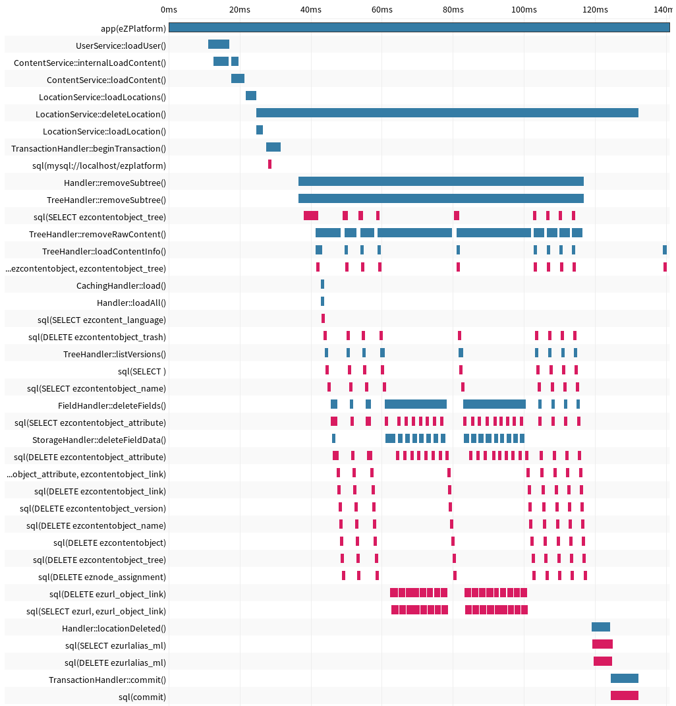

Performance Evaluation
======================

The setup used was the `master` branch (Revision
`9003d96f70a158a9a154ad3284a3b959297b6d6d`) from
<https://github.com/ezsystems/ezplatform.git> with a branch alias to use
the `7.0` branch from
<https://github.com/ezsystems/ezpublish-kernel.git>:

    -        "ezsystems/ezpublish-kernel": "^6.9@dev",
    +        "ezsystems/ezpublish-kernel": "7.0.x-dev as 6.99",

The profiler bundle
(<https://github.com/ezsystems/RepositoryProfilerBundle.git>) had been
installed following its instructions and updated to work with Symfony
3.2. A description on how to craft and run the profiler scenarios is
available in the profiler README:
<https://github.com/ezsystems/RepositoryProfilerBundle>

In these runs variants of the attached [`scenario.php`](./scenario.php) were
used, like:

    app/console cache:clear ; app/console profiler:run papi path/to/scenario.php

Publish Process
---------------

Repetive SQL queries:

-   `INSERT INTO ezcontentobject_attribute`

    The relevant loop is contained in
    `eZ\Publish\Core\Persistence\Legacy\Content\FieldHandler::createExistingFieldsInNewVersion`
    which dispatches to an internal function inserting the fields one
    by one. At this exact location we can change the call to the content
    gateway to perform an aggregate insert without changing any
    public APIs.

    This only happes when we create a new version of existing content.
    It will be worse then in our examples for content with many fields.

-   `SELECT ezcontentobject_name` & `INSERT ezcontentobject_name`

    There are two types of queries executed many times:

    1)  `SELECT COUNT(*) count FROM ezcontentobject_name WHERE ( contentobject_id = ? AND content_version = ? AND content_translation = ? )`

        This query is called when setting a name in a given language to
        check if the following operation is an insert or update.

        This can be optimized for certain RDBMS like Mysql with an
        `INSERT OR UPDATE` statement. This could be further optimized if
        not called for each languages seperately but with all names for
        all languages at once using a batched
        `INSERT OR UPDATE` statement. The method
        `eZ\Publish\Core\Persistence\Legacy\Content\Gateway\DoctrineDatabase::setName`
        should probably be refactored into a `setNames` method receiving
        a hashmaps with all names for all languages.

    2)  `SELECT ezcontentobject_name.contentobject_id ezcontentobject_name_contentobject_id, ezcontentobject_name.content_version ezcontentobject_name_content_version, [..] FROM ezcontentobject_name WHERE ( contentobject_id = ? AND content_version = ? )`

        This query is executed for every published version again
        and again. Since one parameter is the version there is not much
        to optimize here. A future database schema should probably
        de-normalize this information to make these queries unecessary.
        If there is no further need to query by names (except
        for searches) or group by them we will be able to store the
        names as a JSON blob, for example.

-   `SELECT ezcontentobject_tree`

    The exact query repeated multiple times is
    `SELECT * FROM ezcontentobject_tree WHERE node_id = ?` which is
    constructed in
    `eZ\Publish\Core\Persistence\Legacy\Content\Location\Gateway\DoctrineDatabase::getBasicNodeData()`
    which is used in many places so the origins of this call are not
    clear from the traces we have. We could introduce a basic in-memory
    cache for this but the dublicate usage is probably unique to the
    specific test cases in the profiler bundle.

-   `INSERT ezsearch_word`

    The method
    `eZ\Publish\Core\Search\Legacy\Content\WordIndexer\Repository::addWords`
    should perform a batch insert instead of single inserts in a
    for loop.

-   `INSERT ezsearch_object_word_link`

    The method
    `eZ\Publish\Core\Search\Legacy\Content\WordIndexer\Gateway\DoctrineDatabase::indexWords`
    should be refactored to pass a list of words to link to the
    `addObjectWordLink()` method so it can perform a batch insert.

    The method
    `eZ\Publish\Core\Search\Legacy\Content\WordIndexer\Repository::addObjectWordLink`
    should then perform a batch insert instead of single inserts in a
    for loop.

### Summary

-   Refactor field creation to operate as batch function. (1.)
-   Refactor name updates to operate as batch function on all
    translations using `INSERT OR UPDATE` when available in the RDBMS.
    (2.1.)
-   Refactor `WordIndexer\Repository` to perform batch inserts (3. & 4.)

    *Note:* This problem only exists when the legacy SQL based search
    engine is used and not with Solr which is recommened in production
    setups with non-trivial search queries.

Sub-tree Delete
---------------

Profiling of subtree delete showed that several repetitive SQL calls are
done. For instance a subtree delete for like 1000 content objects can
trigger about 30.000 SQL queries because of this. Even a simple (quick)
subtree delete on a small tree causes many repitive deletetions. The
following image shows a subtree delete of about 10 content objects:

What we can easily be seen here are many repeated queries (pink boxes)
for each single content object, and sometimes even multiple queries for
one single content object (`DELETE ezurl_object_link`,
`SELECT ezurl, ezurl_object_link`, `DELETE ezcontentobject_attribute`,
`SELECT ezcontentobject_attribute`).

To solve this problem in an efficient way we probably need to rewrite
the deletion logic entirely to collect all items to delete and then run
a couple of batch operations.

The subtree deletion time at least grows almost linearly with the amount
of content objects:

  Content Objects   Time
  ----------------- --------
  10                0.308s
  50                0.551s
  100               0.873s
  200               1.450s
  300               2.004s
  400               2.920s
  500               3.192s
  750               5.042s
  1000              6.520s

When removing more then 500 content objects at once the garbarge
collector will be triggered multiple times (black boxes) even without a
memory limit – probably because of the sheer amount of objects
instantiated during this action.

This example call is too large for Tideways to display any SQL spans,
but it contained 29,247 database calls taking 4.87s alone with the
following repeated calls detected:

-   `SELECT ezcontentobject, ezcontentobject_tree` was executed 27820
    times and took 4.62 s.
-   `DELETE ezcontentobject_attribute` was executed 138 times and took
    51.1 ms.
-   `SELECT ezcontentobject_tree` was executed 184 times and took
    37.5 ms.

### Summary

Refactor subtree deletion to collecting all (or batches) of objects to
remove and batch operations on all tables into aggregated queries.

View & Search
-------------

Viewing and searching content does not cause any obvious problems
throughout all our tests. The queries may still be complex but are
executed fast. And there are very few queries executed in all our
examples. We need access to (more) real-life use cases to model, analyze
& optimize them.
